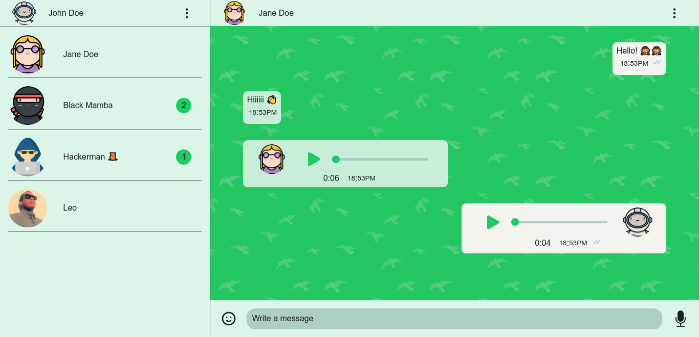
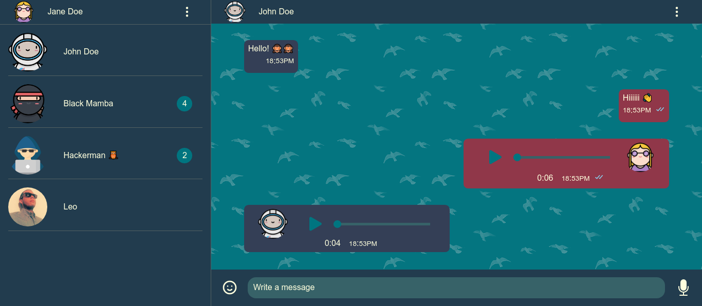

# Aloha Chat App

This project was bootstrapped with [Create React App](https://github.com/facebook/create-react-app).

This project is a fully react hooks app and performs a WhatsApp web like behavior.

Avatars designed by [Freepick](https://www.flaticon.es/autores/freepik) from [Flaticon](https://www.flaticon.es/).

## [View live demo](https://aloha-chat-app-fc64f.web.app/)

## Light theme by default.

## And of course, dark theme can be set too.

Also another features has included, take a look at [Aloha](https://github.com/facebook/create-react-app).
